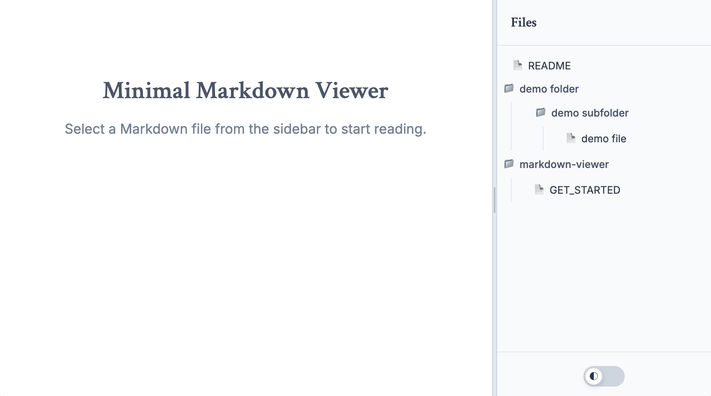

# Get Started with Minimal Markdown Viewer

Welcome! This guide will get you up and running in a minute.

## What is this?

A simple, lightweight tool that turns any folder with Markdown files into a browsable documentation site. Perfect for:
- 📚 Project documentation folders
- 📝 Personal notes collections  
- 🏢 Business document repositories
- 📁 Any folder with `.md` files

## Quick Start

### Installation
You'll need Node.js to run this tool. If you don't have it:
- Visit [nodejs.org](https://nodejs.org) and download the LTS version
- Install it (takes 2-3 minutes)

Once Node.js is installed, open your terminal (Command Prompt on Windows, Terminal on Mac/Linux) and navigate to the `markdown-viewer` folder:

```bash
# Navigate to the markdown-viewer folder
cd markdown-viewer

# Install dependencies (one-time setup)
npm install
```

### Running the Markdown Viewer
Open your terminal (or Command Prompt on Windows, Terminal on Mac/Linux), make sure you're in the `markdown-viewer` folder, then start the program:

```bash
# Make sure you're in the right folder, if not:
cd markdown-viewer

# Start the viewer
npm start
```

Now open your web browser and go to `http://localhost:3000`

**That's it!** You should see all your `.md` files.

## What you'll see

- **File tree sidebar**: All your Markdown files organized by folder
- **Clean reading area**: Professional, minimal design for easy reading
- **Auto-updates**: New files appear automatically (checks every 3 seconds)
- **File info**: See file sizes and modification dates on hover

## Adding it to your project

Want to add this to an existing project with lots of documentation?

1. **Copy the `markdown-viewer` folder** into your project root
2. **Run the setup only when you need it**
3. **Share with your team** - anyone can access the docs at `localhost:3000`

Your project structure might look like:
```
my-awesome-project/
├── README.md
├── docs/
│   ├── api.md
│   └── setup.md
├── markdown-viewer/     ← Add this folder
│   ├── index.html
│   ├── package.json
│   └── ...
└── src/
```

## Troubleshooting

**Files not showing up?**
- Make sure they end with `.md`
- The viewer ignores system folders like `.git` and `node_modules`
- Try refreshing the browser

**Want to customize?**
- Edit `style.css` for different colors/fonts
- All files are plain HTML/CSS/JavaScript - no build process needed!

## Need help?

- Check the main [README.md](README.md) for technical details
- Open an issue on GitHub
- The tool is designed to be simple - if it's not working, something's probably misconfigured

## Screenshot



---
